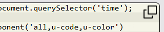
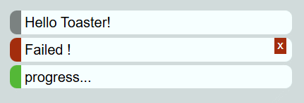
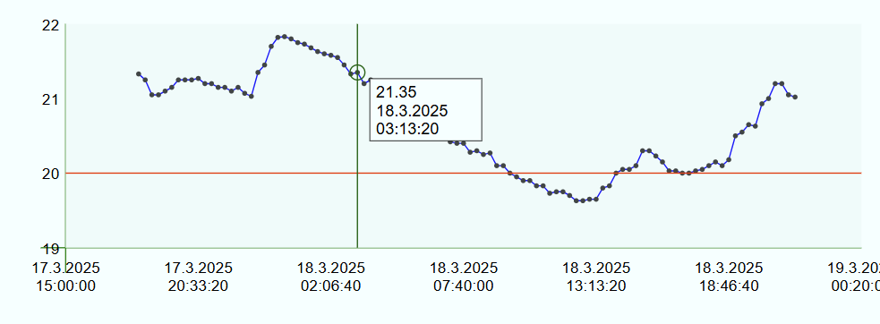
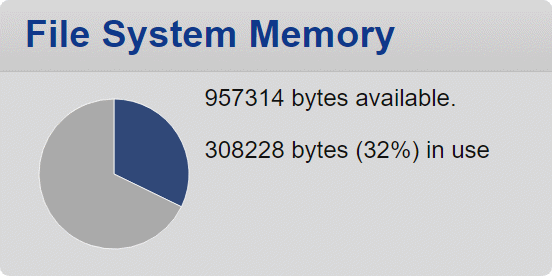
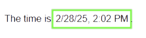

# Components in the SFC library

## Extending existing HTML Elements

### [Dialogs and Forms](dialog-forms.md)

### [Extended Code Component](u-code.md)

## [Toast Component](u-toast.md)

## [LineChart Component](u-linechart.md)

## [PieChart Component](u-piechart.md)

## [Extended Time Element](u-time.md)

## [Web component for capturing duration typed values](u-duration.md)
