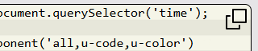

# Web component to

The `u-code` custom Element implementation extends the functionality of the standard `<code>` element to support copying
the displayed code to the clipboard.



In the right upper corner a copy symbol will be shown. By clicking this symbol the content of the `<code>` element is copied to the clipboard and a conirmation is shown for some seconds.


## Setup

The loader script and the custom element definition must be included in the page:

```html
<script src="/loader.js"></script>
<script>
window.loadComponent('u-code');
</script>
```

The `<code>` tag is extended by adding the attribute `is='u-code'`:

```html
<code is="u-code">...</code>
```


## Style Attributes

The standard `u-code` extended `<code>` can be styled according the standard CSS styling attributes.


## HTML and JavaScript accessible Attributes

No custom attributes in use.

