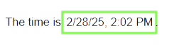

# Web component to display time in user local formatting

The `<time>` element is one of the newer elements in the HTML standard tag collection. Its purpose is to display date and time
values while providing a machine-readable timestamp as an attribute for semantic purposes.

The `u-time` custom Element implementation extends the functionality of the standard `<time>` element to support locale
specific formatting of date, time datetime values by using the SFC loader.



Formatting time or date output is challenging because the appropriate format for users depends on user language preferences. As
this is known at runtime only this cannot be pre-calculated in HTML generating frameworks like Angular or Eleventy. You either
need a dynamic server or handle it client-side.

## Setup

The loader script and the custom element definition must be included in the page:

```html
<script src="/loader.js"></script>
<script>
window.loadComponent('u-time');
</script>
```


## Example

The `u-time` extended `<time>` tag can be placed at the destination and the size can be applied in the style attribute:

```html
<time is='u-time' datetime='2025-03-28 14:09:29' datestyle='short' timestyle='short'>2025-03-28 14:09:29</time>
```

will show up as `3/28/25, 2:09 PM` on `en` locales.

```html
<time is='u-time' datetime='${new Date().toISOString()}' datestyle='medium' timestyle='medium'>${new Date().toISOString()}</time>
```

will show up as `Mar 28, 2025, 2:09:29 PM` on `en` locales.


## Style Attributes

The standard `<time>` component can be styled according the standard CSS styling attributes.


## HTML and JavaScript accessible Attributes

The following attributes can be used to configure the behavior of the extended time element:

* `datetime` -- the value of the date/time to be displayed. A date object or ISO date format can be used.
* `datestyle` -- the style of the date part beeing displayed. Possible values are `"full"`, `"long"`, `"medium"`, and `"short"`.
* `timestyle` -- The style of the time part beeing displayed  Possible values are `"full"`, `"long"`, `"medium"`, and `"short"`.
<!-- * `timezone` -- The timezone to be used. The local timezone is used as default when undefined.  -->

The `"medium"` format is default for datestyle and timestyle.

The convertion of the given time is done by using the `Intl.DateTimeFormat` API in the browser.


## Implementation details

The browser's `Intl` namespace, which aids in internationalization, makes it easy to format dates and times into
user-expected formats.

in JavaScript this is done by some script:

``` js
const fmt = new Intl.DateTimeFormat(navigator.languages, {
  dateStyle: 'medium',
  timeStyle: 'short',
});
this.textContent = fmt.format(new Date('2025-03-28 14:09:29'));
```

This formatting is wrapped into a Custom Component implementation named `u-time` that extends the regular `<time>` element
by adjusting the shown textual value from the given datetime attribute. No need to specify a text inside the time element.


### The JavaScript Date Object

The Date object in JavaScript is used to hold values of dates and times. It is implemented by using a numeric value in
milliseconds representing a single moment in time since January 1, 1970, UTC (the epoch).

The value is always stored using the in UTC timezone (offset === 0). The Date Object allows some formatting related to UTC timezone
and the local timezone configured in the browser or system.

This is very limited in functionality.

Hint: With the introduction and adoption of the new **Temporal** API, these limitation will be overcome. Consider using Temporal in the future.


### Dates from and to datetime values

Imagine the situation of a application with the need of datetime values that is used by people from multiple location around the world.

The common problem that we need to solve is storing datetime values in databases in a format that is usable for this situation.
It is obvious that the time in the database must be timezone neutral and therefore the "UTC" timezone with offset === 0 fits
best.

The Date constructor supports both situations: local timezone and UTC times by using the ISO 8601-1:2019 notation:

``` js
// Create a Date object from a local time string:
const t_local = new Date('2025-05-21T08:10:50.992');

// Create a Date object from a UTC time string:
const t_utc = new Date('2025-05-21T08:10:50.992Z');
```

So when we have to create a Date at the client side the ISO format with the 'Z' indicating the UTC timezone.

When working with JSON based data the Date convertion doesn't work out of the box. Datetime values must be explicitely converted
like:

``` js
const jsonText = '{"start": "2025-04-01T12:30:00Z"}'
const data = JSON.parse(jsonText); // creates the start attribute as string 
data.start = new Date(data.start); // convert from string to date
```

The other way is automatic and always serializing using the UTC timezone:

``` js
const data = { "start" : new Date("2025-04-01T12:30:00Z") };
console.log(JSON.serialize(data)); // prints '{"start":"2025-04-01T12:30:00.000Z"}'
```


### Intl.DateTimeFormat

The `Intl` namespace contains some helpful methods and classes for working with dates and times. The DateTimeFormat class e.g.
supports language- and timezone-sensitive date and time formatting that can be used together with Date objects.

To format in the user defined language (navigator.languages) or other languages and the local timezone sing an expressive format
you can use:

``` js
const data = { "start" : new Date("2025-04-01T12:30:00Z") };
const fmt = new Intl.DateTimeFormat(navigator.languages, { dateStyle: 'full', timeStyle: 'full' });
console.log(fmt.format(data.start)); // prints "Tuesday, April 1, 2025 at 2:30:00 PM Central European Summer Time" for English in Germany
```

or

``` js
const data = { "start" : new Date("2025-04-01T12:30:00Z") };
const fmt = new Intl.DateTimeFormat('fr', { dateStyle: 'full', timeStyle: 'full' });
console.log(fmt.format(data.start)); // prints "mardi 1 avril 2025 à 14:30:00 heure d’été d’Europe centrale" for French in Germany 
```

or even specify the timeZone for formatting:

``` js
const data = { "start" : new Date("2025-04-01T12:30:00Z") };
const fmt = new Intl.DateTimeFormat('en', { dateStyle: 'full', timeStyle: 'full' , timeZone: 'Asia/Shanghai'});
console.log(fmt.format(data.start)); // prints "Tuesday, April 1, 2025 at 8:30:00 PM China Standard Time"
```

For simplification the Date object has the `toLocaleString()` method that exacly delegates to the Intl.DateTimeFormat function.

``` js
const data = { "start" : new Date("2025-04-01T12:30:00Z") };
console.log(data.start.toLocaleString('en', { dateStyle: 'full', timeStyle: 'full' , timeZone: 'Asia/Tokyo'}));
```


## See also

* [HTML time element](https://developer.mozilla.org/en-US/docs/Web/HTML/Element/time)
* [About time formatting](https://developer.mozilla.org/en-US/docs/Web/JavaScript/Reference/Global_Objects/Intl/DateTimeFormat/DateTimeFormat)

